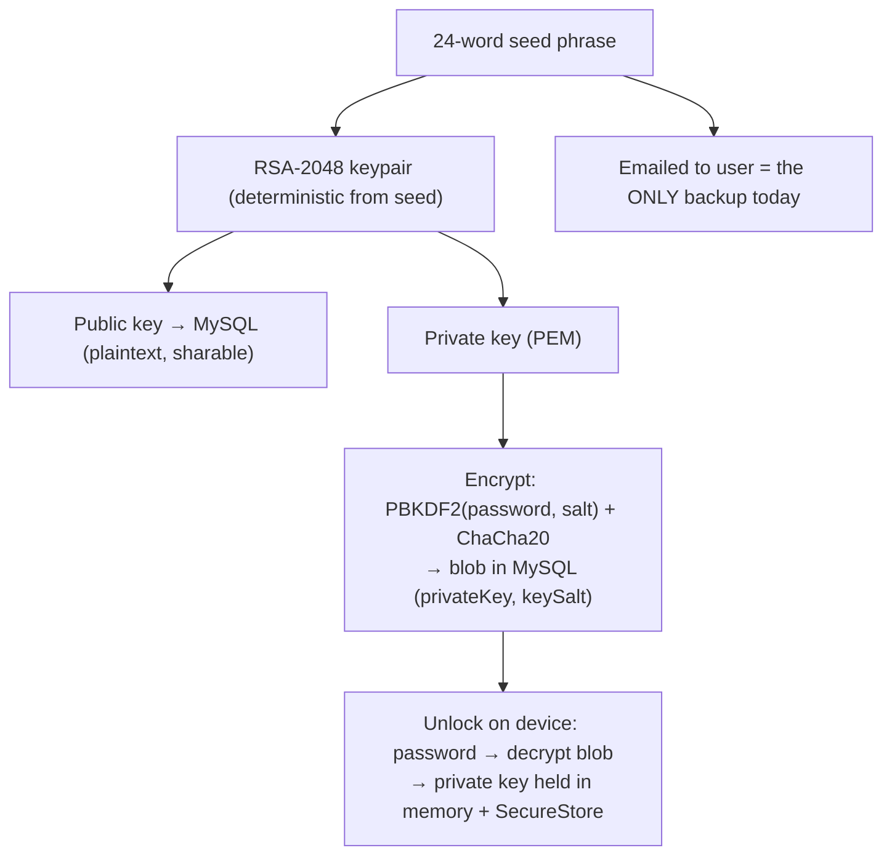
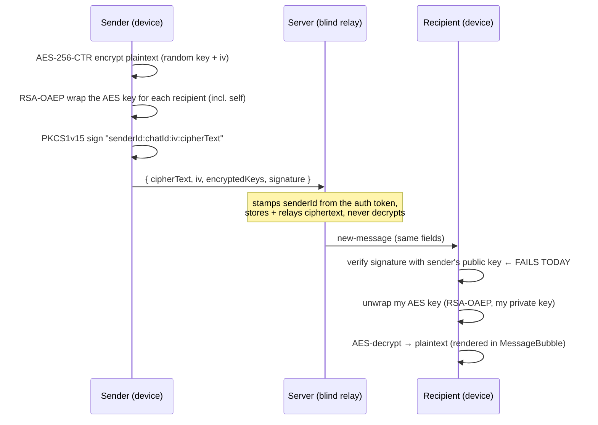
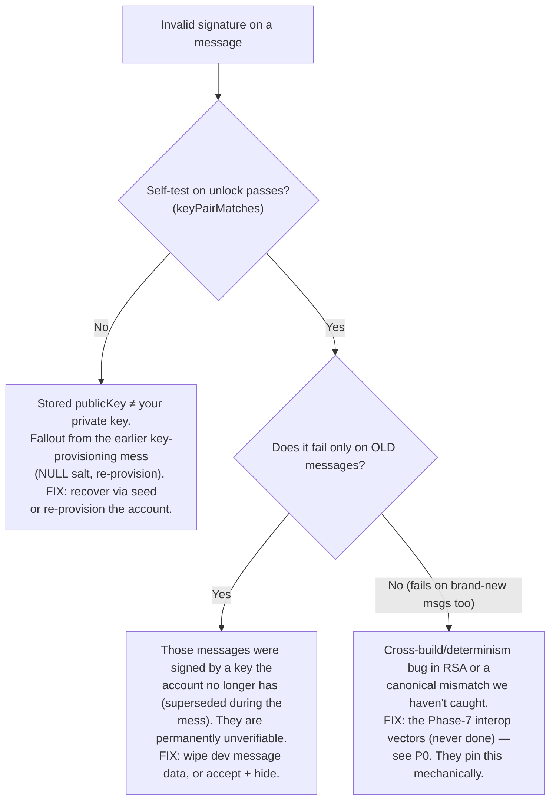

# Aegis — UX & Hardening Plan

> Companion to `AEGIS_ENCRYPTION_ROADMAP.md`. That document was the plan for **building** the
> crypto. This one is the plan for making it **correct, recoverable, and pleasant to use** — turning
> a cryptographically-ambitious project into a product people can actually trust and operate.
>
> Written after a live debugging session that (1) fixed key persistence + unlock reachability, (2)
> added a key-pair self-test, and (3) surfaced the current blocker (signature verification). Read
> sections 1–2 before touching anything; the rest is a prioritized work map with acceptance criteria.

---

## 1. Read this first — current state of play

We have moved through **three distinct failure stages**. Each looked like "messaging is broken,"
but they are different layers of the same pipeline:

| Stage | Symptom in UI | Layer | Status |
|---|---|---|---|
| 1 | `🔒 Keys not loaded` / `Crypto session not initialised` | Key **loading** (session has no private key) | **Fixed** this session |
| 2 | `⚠️ Invalid signature` | Message **verification** (signature check fails) | **Current blocker** — diagnosed + guard added |
| 3 | (next) `Could not decrypt` / wrong recipient | Message **decryption** (OAEP unwrap / AES) | Not yet reached for most messages |

The important mental shift: **"it's broken" is not one bug.** It's a pipeline, and each fix reveals
the next stage. That's normal for layered crypto. The work below is structured so you stop fighting
symptoms and instead make each layer *self-verifying* and *self-explaining*.

---

## 2. How Aegis actually works (the mental model)

You cannot design good UX for this app without holding this model. Everything in section 5 is
"make each of these steps visible and recoverable."

### 2.1 Two independent layers: identity vs. encryption

These are **separate** and conflating them is the source of most confusion:

- **Identity / login = Clerk.** Who you are. Email+password or Google. Gives you a session token.
- **Encryption = your "encryption password" + key pair.** What lets you read messages. The password
  here protects your *private key*; it is conceptually distinct from "logging in," even though today
  it's the same string you typed at sign-up.

> Why split? (From the roadmap's hybrid decision.) Keeping Clerk for login avoided a risky full auth
> migration, while still satisfying "the private key is protected by a password we control." The
> **cost** of the split is the thing biting you now: your Clerk login can succeed while your
> encryption keys are missing, mismatched, or locked — so "I'm logged in but can't read messages" is
> a *normal* state the UX must handle, not an error.

### 2.2 The key lifecycle (where every secret lives)

- **Public key** — MySQL `publicKey`, plaintext. Anyone can encrypt *to* you and verify *your*
  signatures with it.
- **Private key** — never stored in the clear. Encrypted into `privateKey` + `keySalt` with a key
  derived from your password (PBKDF2, 310k iterations). Lives **decrypted only in memory** during a
  session, and in the device keychain (`expo-secure-store`) so it survives restarts.
- **Seed phrase (24 words)** — the master backup. Re-derives the *identical* private key, so it's how
  you recover after a forgotten password or a new device. **Today it is only emailed** — see 5.1.

**The invariant the whole app depends on:**
> The `publicKey` stored for a user **must** correspond to the private key that user holds.
> When that breaks, you get exactly today's symptom — `Invalid signature` and undecryptable messages.

### 2.3 The message lifecycle (send → blind relay → receive)

Three independent guarantees ride on this: **confidentiality** (AES + OAEP — only holders of a
recipient private key can read), **authenticity** (the signature — proves who sent it), and **blind
relay** (the server only ever sees ciphertext). The signature is checked **first** on receive, which
is why a signature problem blocks *everything*, even messages that would otherwise decrypt fine.

---

## 3. What we fixed this session (so it's recorded)

1. **Keys now persist at sign-up.** `app/(auth)/sign-up.tsx` provisioned keys into memory but never
   wrote them to the keychain, so they vanished on restart. Added `persistKeys(...)`. (Stage-1 root
   cause.)
2. **The unlock modal is reachable app-wide.** `CryptoUnlockModal` was mounted only inside
   `(tabs)/_layout`, so a conversation opened on top of it (`app/chat/[id].tsx`) had no way to
   unlock. Moved it to the root layout with a guard so it never covers the auth or recovery screens.
3. **Key-pair self-test on unlock.** New `keyPairMatches()` in `RsaSign.ts`, wired into
   `useCryptoUnlock` and `useEmailSignIn`. If the decrypted private key doesn't match the account's
   stored public key, we now flag for recovery instead of loading a broken session that fails every
   message silently. **This is also the diagnostic that confirms the Stage-2 cause on your next run.**

---

## 4. The current blocker: `Invalid signature` — diagnosis

**What I verified by reading the code:**

- The PKCS1v15 sign/verify math is **correct** and round-trips (`RsaSign.ts` + `RsaMath.ts`;
  `bigIntToBytes` pads to the full modulus length, so no leading-zero bug).
- The signed string is `senderId:chatId:iv:cipherText`. On both ends `senderId` resolves to
  `String(userID)` (client `mapUser` → `_id`; server `socket.data.userId`), `chatId` and the
  hex `iv`/`cipherText` are echoed verbatim by the relay. **So the canonical string matches.**
- For your *own* messages, verification uses the **session public key, which is guaranteed to pair
  with your in-memory signing key** (`chat/[id].tsx:48`) — yet it still fails.

**Therefore the cause is not the algorithm. It is one of:**

The most likely branch, given this account's history, is **mismatch** (left). The self-test added in
§3.3 will tell you definitively on the next unlock: if it routes you to recovery, it's a stored-key
mismatch; if it loads cleanly but messages still show `Invalid signature`, it's stale/old-key data.

**Why this keeps happening and how to stop it (the real fix, in P0):**
- Key writes aren't atomic/guarded enough — the account reached a state where `publicKey` and
  `privateKey` describe different key pairs. Make provisioning + recovery write all of
  `{publicKey, privateKey, keySalt}` in one transaction and **reject** partial states.
- The from-scratch RSA was never tested against a reference (roadmap Phase 7 is unchecked). Add
  sign/verify + OAEP **interop vectors vs. WebCrypto** so "runs but produces wrong bytes" is caught.

---

## 5. The UX map — every crypto state and what good UX should do

This is the heart of the request. The principle: **never show the user a raw cryptographic failure.**
Each state below is something the *math* can be in; the job of UX is to translate it into a calm,
honest, actionable human state. States are ordered by how often a real user hits them.

### 5.1 First-run key setup & seed backup — **highest priority, currently dangerous**
- **Now:** after sign-up the 24 recovery words are *only emailed*. If the email is lost and the
  password forgotten, **every message is permanently unreadable.** There is no in-app backup screen.
- **Good UX:** a one-time, post-sign-up **"Save your recovery phrase"** screen — show the 24 words,
  require a "I've saved these" confirmation (ideally a 2-word re-entry check), explain in one line
  *why* (this is the only way back in; we can't reset it for you — that's the point of E2E).
- *Why it matters:* in a blind-server design, recovery is the user's responsibility by construction.
  The backup screen **is** the safety net; email alone is a single point of catastrophic data loss.

### 5.2 Unlock on launch / new device
- **Now:** modal appears when `privateKeyPem` is null; asks for password; on success loads + persists.
  No progress indicator (PBKDF2 at 310k is genuinely slow in JS — seconds on a phone), wrong-password
  copy is generic, and there is **no "Forgot password?" link** — so a user who forgot is stuck.
- **Good UX:** "Unlocking your messages…" progress state; clear wrong-password error; a **"Forgot
  password? Recover with your seed phrase"** link that routes to the recovery screen; remember that
  unlock persists to *this* device only (multi-device note, 5.7).

### 5.3 Key mismatch / can't load keys — **new state from the self-test**
- **Now:** silent — every message just says `Invalid signature`. Dead end.
- **Good UX:** a dedicated state: "Your keys on this device don't match your account. Recover with
  your seed phrase to fix this." → one tap into recovery. (The self-test now drives this via
  `keyLoadFailed`; the screen/copy still needs building — see P1.)

### 5.4 Per-message decrypt/verify failure
- **Now:** raw bubbles — `⚠️ Invalid signature`, `Could not decrypt message`, `🔒 Keys not loaded`,
  `Sender key unavailable` (`MessageBubble.tsx`). Alarming and meaningless to a user.
- **Good UX:** distinguish the *three* genuinely different causes and speak plainly:
  - keys not loaded → "Unlock to read this message" (+ unlock CTA), not an error.
  - not encrypted for me / no key slot → "This message wasn't encrypted for your account."
  - signature/verify fail → a quiet "Couldn't verify this message" with an optional **"Why?"** that
    explains, rather than a red warning that implies the user did something wrong.
  - Keep the security guarantee (don't render unverified content) but lower the visual alarm.

### 5.5 Send gating — stop letting people type into a dead end
- **Now:** you can type a full message and only discover on **send** that keys aren't loaded
  (`socket.ts` throws + Alert) or recipient keys are missing (`chat/[id].tsx` Alert). Frustrating.
- **Good UX:** reflect readiness *in the composer*: if your keys aren't loaded, the input shows
  "Unlock to send" and the send button routes to unlock; if a recipient's public key hasn't arrived,
  show a subtle "preparing secure channel…" and disable send. Decide *before* the user invests typing.

### 5.6 Recovery flow (24 words)
- **Now:** `useKeyRecovery` + a `recover` route exist, but discovery is weak (only via settings when
  `keyLoadFailed`). The unlock modal — where stuck users actually are — doesn't link to it.
- **Good UX:** reachable from (a) the unlock modal, (b) settings → security, (c) the key-mismatch
  state. Clear 24-word entry with validation, a progress state (re-deriving keys is slow), and an
  explicit success → "You're back in. Old messages are readable again."

### 5.7 Verification / 2FA, and multi-device
- Gate messaging on `isVerified` with a friendly "verify your email to start messaging" state
  (rather than letting unverified users hit opaque failures).
- Multi-device: each device unlocks independently and persists its own copy; say so once, so users
  aren't surprised that a new device asks for the password again.

### State → UX summary

| Crypto state | Today | Target UX | Priority |
|---|---|---|---|
| No seed backup | email only | in-app backup + confirm | **P1** |
| Keys not in session | modal (ok) | + progress + forgot link | P1 |
| Key pair mismatch | silent fail | recovery state + CTA | **P1** |
| Msg can't verify | red warning | calm "couldn't verify" + Why | P1 |
| Msg not for me | raw error | plain explanation | P2 |
| Keys not loaded for a msg | raw error | "unlock to read" CTA | P1 |
| Can't send (no keys) | Alert after typing | composer gating | P1 |
| Recovery | hard to find | reachable + guided | P1 |
| Unverified email | opaque | "verify to start" gate | P2 |

---

## 6. Full-app UX polish (beyond crypto)

The encryption states above are the trust-critical core. These make the rest feel finished:

- **Consistent loading / empty / error states** across chat list, conversation, new-chat, new-group,
  settings: skeletons instead of bare spinners, friendly empty states (some exist — `EmptyUI`), and
  error states with a retry rather than silent blank screens.
- **Message status & metadata:** sent/delivered indicator (you already ack via `message-ack`),
  timestamps, grouped bubbles, day separators. Today bubbles are bare.
- **Presence & typing:** you have online/offline + typing wired — surface them consistently
  (the header shows it; the chat list could too).
- **Theming & a11y pass:** the app mixes NativeWind utility classes with large inline style objects
  (`CryptoUnlockModal`, `chat/[id]`). Consolidate into tokens; check color contrast (WCAG AA),
  touch-target sizes (44px), and screen-reader labels on icon-only buttons (back, call, send).
- **Onboarding:** a one-screen "your messages are end-to-end encrypted — here's what that means for
  you (backup your phrase, we can't read or reset)" sets correct expectations and pre-empts 5.1/5.6.
- **Settings → Security section:** view/re-backup recovery phrase, "this device" key status,
  sign-out wipes keys (`clearPersistedKeys`), and a re-key/recover entry point.

---

## 7. Phased work plan (prioritized, with acceptance criteria)

### P0 — Correctness & unblock (do first; nothing else matters if the crypto is wrong)
- [x] Key-pair self-test on unlock (done this session).
- [ ] **Confirm the Stage-2 cause** using the self-test on a real run; follow the §4 decision tree.
- [ ] **Interop test vectors** (roadmap Phase 7, never done): sign/verify and RSA-OAEP **against
      WebCrypto** with the same keys; PBKDF2 (RFC 6070-style equivalence vs `crypto.subtle`);
      determinism: same 24 words → identical keys on Node and on device.
      *Done when:* a committed test suite passes; a tampered byte fails verify.
- [ ] **Atomic key writes + reject partial state** in `provisionKeys` / `registerKeys` /
      `recoverKeys` (transaction around `publicKey`+`privateKey`+`keySalt`; never store a mismatched
      pair). *Done when:* it's impossible to end with `publicKey` not matching `privateKey`.
- [ ] **Reset the messed-up dev accounts** (re-provision or wipe message data signed by old keys).
      *Done when:* two fresh accounts send → receive → verify → decrypt cleanly both ways.

### P1 — Core security UX (the states users actually hit)
- [ ] Seed-backup screen after sign-up (5.1). *Done when:* a new user must acknowledge the phrase.
- [ ] Unlock modal: progress + wrong-password + "Forgot password?" link (5.2).
- [ ] Key-mismatch recovery state driven by `keyLoadFailed` (5.3).
- [ ] Humane per-message states; distinguish the three causes (5.4).
- [ ] Composer send-gating (5.5).
- [ ] Recovery flow reachable + guided (5.6).
      *Done when:* a user who forgets their password can self-recover end-to-end without support.

### P2 — Full-app polish
- [ ] Loading/empty/error states everywhere; message status + timestamps + grouping (6).
- [ ] Theming tokens + a11y pass (contrast, targets, labels).
- [ ] Onboarding + Settings → Security section.
- [ ] Unverified-email gate (5.7).

### P3 — Hardening / later
- [ ] Authenticated encryption for messages (AES-GCM, or sign already covers integrity — document the
      choice) and an HMAC/GCM tag on the private-key-at-rest blob.
- [ ] Multi-device story, group-key management, then the proposal's WebRTC video.

**Dependency order:** P0 → P1 (seed-backup + recovery before anything, since they protect against
data loss) → P2 → P3.

---

## 8. Where each change lives (file checklist)

| Work item | Files |
|---|---|
| Self-test (done) | `lib/crypto/rsa/RsaSign.ts`, `hooks/useCryptoUnlock.ts`, `hooks/useEmailSignIn.ts` |
| Interop/determinism tests | new `lib/crypto/__tests__/` (or `backend` test dir) |
| Atomic key writes | `backend/src/controllers/authController.ts`, `backend/src/queries/userQueries.ts` |
| Seed-backup screen | new `app/(auth)/backup-phrase.tsx`; hook into `sign-up.tsx` after provision |
| Unlock progress + forgot link | `components/CryptoUnlockModal.tsx` |
| Key-mismatch state | `components/CryptoUnlockModal.tsx` / a new recovery entry; `app/(tabs)/settings.tsx` |
| Per-message states | `components/MessageBubble.tsx` |
| Send gating | `app/chat/[id].tsx`, `lib/socket.ts` |
| Recovery discoverability | `components/CryptoUnlockModal.tsx`, `app/recover.tsx`, `settings.tsx` |
| App-wide polish | chat list, `EmptyUI`, theming config, icon buttons across screens |

---

## 9. Why this matters (the stakes)

- **Recovery UX *is* the product.** A blind server can't reset your password or read your history —
  by design. So the seed-backup and recovery flows aren't "nice to have"; they're the only thing
  standing between a forgotten password and permanent, total data loss. Today that safety net is a
  single email.
- **Looking broken reads as being insecure.** Raw `Invalid signature` bubbles make a *correct* crypto
  system feel untrustworthy. For a security product, the calm/honest presentation of failure is part
  of the security guarantee, not cosmetic.
- **Silent failure is the worst failure.** The whole pattern of this debugging session — keys silently
  not persisted, silently mismatched, silently failing to verify — is the dangerous one. The fixes
  above convert silent failures into **detected, explained, recoverable** states. That's the real
  theme of this plan.

---

## 10. Open decisions

1. **Reset strategy for the broken dev accounts** — re-provision in place, or wipe and re-create?
2. **Backup-phrase UX** — show once with confirm, or also allow re-viewing later in Settings (trade-off:
   convenience vs. shoulder-surfing risk)?
3. **Message integrity** — rely on the RSA signature alone, or also add AES-GCM? (Affects P3 scope.)
4. **Old un-verifiable messages** — hide them, show a "couldn't verify (old key)" tombstone, or purge?
