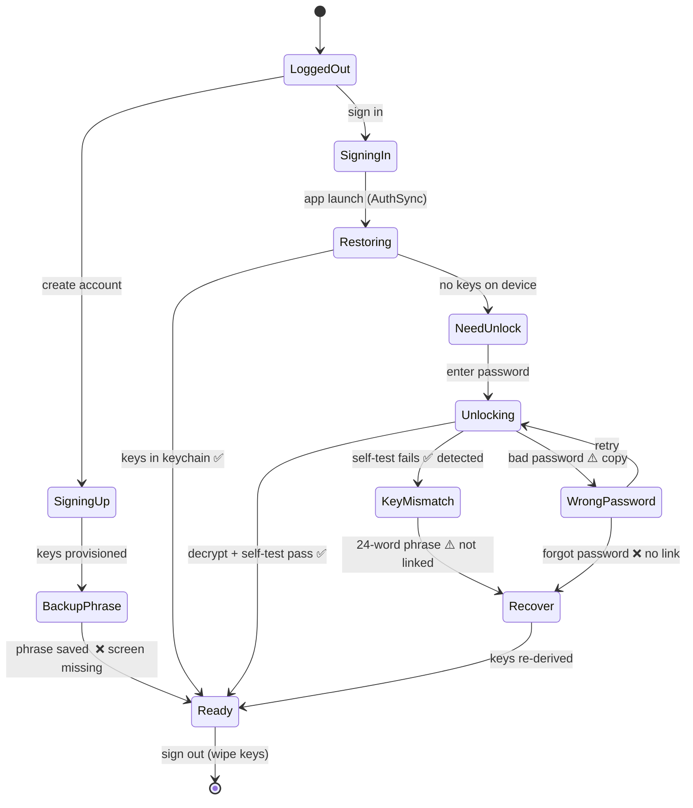
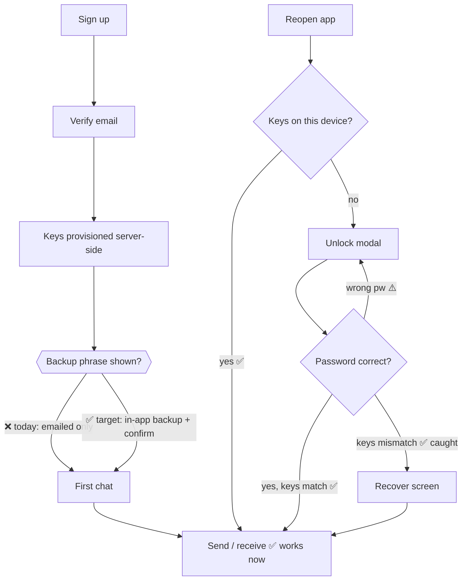
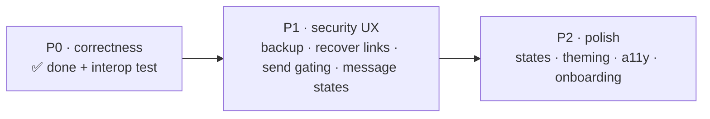

# Aegis — UX Map

> A map of every state the app can put a user in, what happens there **today**, where it hurts, and
> what **good UX** should do — ordered so you can walk it top to bottom and build in priority order.
>
> Companion to `AEGIS_UX_AND_HARDENING_PLAN.md` (the phased plan + crypto hardening). This doc is the
> **map**: the screens, the flows, the states. Updated to reflect that the crypto pipeline now works
> end to end.

---

## Legend

| Mark | Meaning |
|---|---|
| ✅ | Done / working |
| ⚠️ | Exists but has a UX gap |
| ❌ | Missing entirely |
| 🔒 | Security-critical (data-loss or trust risk if wrong) |

**Priority:** `P0` correctness/unblock · `P1` core UX · `P2` polish.

**Where we are now (so the map is honest):**
✅ keys persist at sign-up · ✅ unlock modal reachable app-wide · ✅ key-pair self-test ·
✅ `e=65537` encoding fixed (messages verify + decrypt) · ✅ send no longer hangs.
The rest of this map is what's left.

---

## 1. The encryption UX state machine

Every screen below is just a node in this machine. The whole job of the UX is to make each
transition visible, explained, and recoverable.

The two red edges (`BackupPhrase`, and the `Recover` links out of `WrongPassword`/`KeyMismatch`) are
the highest-value gaps: **today a user can reach a state they can't get out of without you touching
the database.**

---

## 2. The user journey (happy path + where it forks)

---

## 3. Screen-by-screen map

| Screen / State | When it appears | Today | Gap | Target UX | Pri | Files |
|---|---|---|---|---|---|---|
| **Sign-up** | New account | Username/email/pw, provisions keys | — | + a one-line "your messages are end-to-end encrypted" primer | P2 | `app/(auth)/sign-up.tsx` |
| **Verify email** | After sign-up | 6-digit code | ok | Resend cooldown, clearer error | P2 | `sign-up.tsx` |
| 🔒 **Backup phrase** | Right after provisioning | ❌ **missing** — words only emailed | Single point of total data loss | Show 24 words, "I've saved these" confirm (2-word re-entry), explain why it can't be reset | **P1** | new `app/(auth)/backup-phrase.tsx` |
| **Sign-in** | Returning, logged out | Email/pw → loads keys ✅ | — | "Unlocking…" state on slow PBKDF2 | P1 | `app/(auth)/sign-in.tsx`, `hooks/useEmailSignIn.ts` |
| **Unlock modal** | Authed but no keys in session | ✅ reachable app-wide now | No progress, weak wrong-pw copy, **no recover link** | Progress spinner, clear error, "Forgot password? Recover with seed phrase" link | **P1** | `components/CryptoUnlockModal.tsx` |
| 🔒 **Key-mismatch** | Self-test fails on unlock | ✅ detected → message shown | Dead-ends on an Unlock-only modal | Dedicated state → one tap to Recover | **P1** | `CryptoUnlockModal.tsx`, `settings.tsx` |
| 🔒 **Recover (24 words)** | Forgot pw / mismatch / new device | Route + hook exist | Hard to reach; no progress/success states | Reachable from modal + settings; validated entry; "you're back in" success | **P1** | `app/recover.tsx`, `hooks/useKeyRecovery.ts` |
| **Chat list** | Home tab | Works | Bare loading/empty | Skeletons, unread, last-message preview | P2 | `app/(tabs)/index.tsx` |
| **Conversation** | Open a chat | ✅ E2E works | Send gating, message states (below) | See §4 + §5 | P1 | `app/chat/[id].tsx` |
| **Settings** | Settings tab | Has recovery entry on `keyLoadFailed` | No security section | "Security": view/re-backup phrase, this-device key status, sign-out wipes keys | P2 | `app/(tabs)/settings.tsx` |
| **Unverified gate** | `isVerified = 0` | ❌ none | Unverified users hit opaque failures | "Verify your email to start messaging" state | P2 | new gate |

---

## 4. The composer (send) — readiness map

Decide **before** the user invests typing. Today they type, hit send, then get an Alert.

| Composer state | Trigger | Today | Target UX | Pri |
|---|---|---|---|---|
| Ready | keys loaded, recipient keys present | send works ✅ | — | — |
| My keys not loaded | `privateKeyPem` null | type → Alert on send ⚠️ | input shows **"Unlock to send"** → opens unlock | P1 |
| Recipient key missing | participant `publicKey` not arrived | Alert "Can't send yet" | subtle "preparing secure channel…", send disabled | P1 |
| Sending | in flight | spinner ✅ (now resolves) | + timeout → "send failed" instead of hang | P1 |
| Send failed | server/timeout | Alert | inline retry on the bubble | P2 |

---

## 5. Per-message bubble — state map

Never show a raw crypto error. Distinguish the three genuinely different causes.

| Bubble state | Real cause | Today | Target UX | Pri |
|---|---|---|---|---|
| Plaintext | decrypted ✅ | shows text ✅ | — | — |
| 🔒 Keys not loaded | your session locked | `🔒 Keys not loaded` | "Unlock to read" + CTA (not an error) | P1 |
| Can't verify | signature invalid (e.g. old key) | `⚠️ Invalid signature` (alarming) | quiet "Couldn't verify this message" + optional **Why?** | P1 |
| Not for me | no key slot for my id | `Could not decrypt` | "This message wasn't encrypted for your account" | P2 |
| Sender key missing | sender pubkey not loaded | `Sender key unavailable` | "Verifying sender…" then resolve | P2 |

> Keep the security guarantee (don't render unverified content) — just lower the visual alarm and
> explain. A correct crypto system that *looks* broken reads as untrustworthy.

---

## 6. Full-app polish map (non-crypto)

| Area | Today | Target | Pri |
|---|---|---|---|
| Loading states | bare spinners | skeletons on list + conversation | P2 |
| Empty states | partial (`EmptyUI`) | consistent across list/new-chat/group | P2 |
| Error states | silent / blank | retry affordances | P2 |
| Message meta | bare bubbles | timestamps, day separators, grouping, sent/delivered (you already `message-ack`) | P2 |
| Presence/typing | wired | surface consistently (list + header) | P2 |
| Theming | mixes NativeWind + inline styles | tokens; one source of truth | P2 |
| Accessibility | icon-only buttons unlabeled | labels (back/call/send), 44px targets, AA contrast | P2 |
| Onboarding | none | one screen: what E2E means for you | P2 |

---

## 7. Build order (the "what to do" map)

**P0 — correctness (mostly done):** ✅ encoding fix, self-test, send ack. ➕ remaining:
RSA-vs-WebCrypto **interop test** (would've caught `e=65537`); add self-test to `AuthSync` restore;
client send **timeout**.

**P1 — security UX (do next, top-down):**
1. 🔒 Backup-phrase screen after sign-up.
2. Recover link in the unlock modal + key-mismatch state (closes the dead-end you hit).
3. Composer send-gating.
4. Humane per-message states.
5. Unlock progress + wrong-password copy.

**P2 — polish:** loading/empty/error states, message metadata, theming tokens, a11y, onboarding,
unverified gate.

---

## 8. The one-line "why" for each priority

- **Backup phrase (P1, 🔒):** blind server = we can't reset you. The phrase is the *only* way back;
  email alone is one click from permanent, total data loss.
- **Recovery links (P1):** you literally hit this — a mismatched/forgot user is trapped behind an
  Unlock-only modal with no way out but the database.
- **Send gating + message states (P1):** stop surfacing raw crypto failures; they make a working
  system feel broken and untrustworthy.
- **Polish (P2):** makes a correct, recoverable app feel finished.
